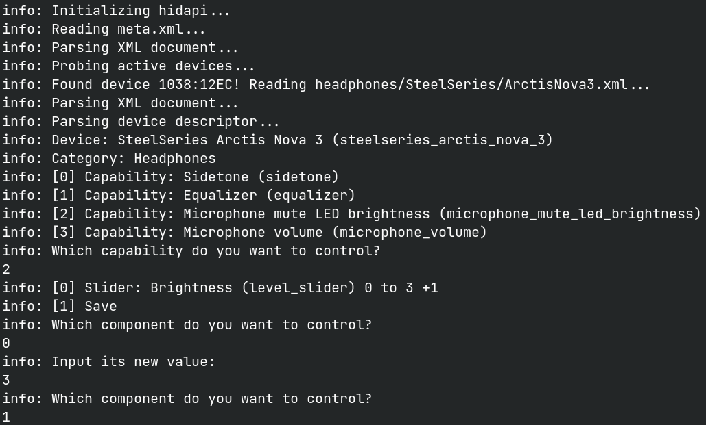

# OpenPeripherals

A Proof of Concept (PoC) for a versatile standard for driving USB and Bluetooth peripherals via the HID protocol.

# Building

You need the `hidapi` system library installed in order to build this PoC. You can then run `zig build` to compile it.
Currently, this has only been tested on Linux, and so may not build on other systems (yet).

